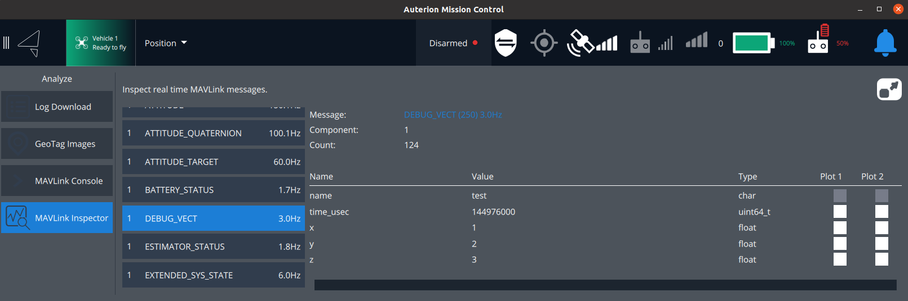

# Publisher Examples

This package contains five executables that publish different vehicle commands or similar from ROS2 to PX4.  


For all examples start any robot, e.g.

```
user@ubuntu:~/PX4-Autopilot$ make px4_sitl_rtps gazebo_rover
```

**Note:** that for the flying related examples you can try other robots like

```
make px4_sitl_rtps gazebo # standard quadrotor
make px4_sitl_rtps gazebo_plane
make px4_sitl_rtps gazebo_standard_vtol
```

and more [here](https://docs.px4.io/master/en/simulation/gazebo.html#running-the-simulation).

In another terminal and in a new terminal the bridge agent

```
user@ubuntu:~/colcon-ws$ micrortps_agent -t UDP
```


## debug_vect_publisher

This example sends a [debug_vect](https://github.com/PX4/PX4-Autopilot/blob/master/msg/debug_vect.msg) message to PX4. 
The handy thing about this message is the plotting possibility in QGC. Assuming you have to plot this data in realtime during flight and ROS is no option due to networking constrains, this can be used.



To execute the example, run 

```
user@ubuntu:~/colcon-ws$ ros2 run px4_ros_com_publisher_examples debug_vect_publisher 
```


## arm_publisher / disarm_publisher

Both examples sends out a [vehicle_command](https://github.com/PX4/PX4-Autopilot/blob/master/msg/vehicle_command.msg) message towards PX4 to set the robot in either an armed or disarmed state. 
The vehicle_command message type is a very powerful command in PX4. It can send various commands, defined in the message definition. It can be configured with up to 7 parameter  (see message definition).

For the arm/disarm example we will use the [VEHICLE_CMD_COMPONENT_ARM_DISARM](https://github.com/PX4/PX4-Autopilot/blob/master/msg/vehicle_command.msg#L72) command. From the PX4 code [here](https://github.com/PX4/PX4-Autopilot/blob/master/src/modules/commander/Commander.cpp#L907) (documentation not present yet) we see that the ARM_DISARM requires only param1 to either arm (=1) or disarm (=0) the robot.

To arm, run

```
user@ubuntu:~/colcon-ws$ ros2 run px4_ros_com_publisher_examples arm_publisher
```

and similarly to disarm, run

```
user@ubuntu:~/colcon-ws$ ros2 run px4_ros_com_publisher_examples disarm_publisher
```


## takeoff_publisher / land_publisher

This examples as well utilize the [vehicle_command](https://github.com/PX4/PX4-Autopilot/blob/master/msg/vehicle_command.msg) message to control a PX4 based robot and only make sense on vehicles capable of flying. The *takeoff* only works, if a robot is *armed* already and landing obviously only works on robots that currently fly.

For the takeoff/land example we have to use the [VEHICLE_CMD_DO_SET_MODE](https://github.com/PX4/PX4-Autopilot/blob/master/msg/vehicle_command.msg#L29) command. From the PX4 code [here](https://github.com/PX4/PX4-Autopilot/blob/master/src/modules/commander/Commander.cpp#L786-L789) (documentation not present yet) we see that the SET_MODE requires 3 parameter. This is similar to MAVLink specification to [set a mode](https://mavlink.io/en/messages/common.html#MAV_CMD_DO_SET_MODE).

 * The first one will be set to 1, so we use the *custom modes*
 * The second parameter will define the *custom main mode* and
 * The third parameter will define the *custom submode*
 
See [here](https://github.com/PX4/PX4-Autopilot/blob/master/src/modules/commander/px4_custom_mode.h#L45-L67) for all other mode definitions in PX4. 

To execute the takeoff example, run 

```
user@ubuntu:~/colcon-ws$ ros2 run px4_ros_com_publisher_examples takeoff_publisher
```

and run 

```
user@ubuntu:~/colcon-ws$ ros2 run px4_ros_com_publisher_examples land_publisher
```

to land your robot.